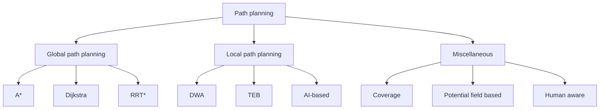

# MPAS | 2025-02-10

## Robot path planning

- Want a sequence of control inputs that lead from a start node $X_S$ to a goal node $X_G$
  - Additionally want collision-free, least-cost, efficient and safe paths

- For systems wuth underactuated dynamics, there are restrictions to move to certain locations

- Global path planning
  - Global map is accessible
- Coverage path planning
  - Goal is to cover all areas
  - Eg: Cleaning robots
- Visibility graphs
- Minkowski sum

## Sampling-based motion planning

- Boundary value problems
  - Solved by non-linear optimisation

### Probabilistic roadmap (PRM) approach

- Sample points from the configuration space
- Collision check performed
  - Points cannot lie on obstacles

- Milestones $\to$ Points in the free space, i.e., collision-free configurations
- Connect nearest neighbour milestones through collision-free straight paths, forming the PRM
  - Paths cannot pass through obstacles
- Connected component graph
  - Can track $X_S$ and $X_G$ until they are in the same connected component

- Computationally more practical than $A^*$
- Can implement in $O(n \log (d / \varepsilon))$?
- Probabilistically complete; Will eventually find the solution if it exists, if run long enough
- Challenges/ Limitations
  - Need to solve a boundary value problem, generally
  - Needs collision checking, which is time consuming; Cannot avoid
  - No particular focus on generating paths

#### Sampling

- Uniform sampling in $[0, 1]^n$
  - Can obtain unbiased samples
- Uniform sampling on an $n$-D unit sphere
  - No bias for any particular direction
- Uniform sampling for 3D orientations
  - Generating random unit quaternions from a normal distribution

---

