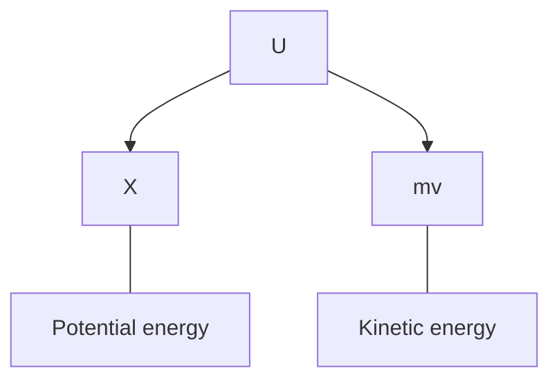

# MPAS | 2025-03-10

## Artificial potential fields

$$
\Delta x = \Delta \dot x \Delta t + \frac{1}{2} \Delta \ddot x {\Delta t}^2
$$

$$
X_{n+1} = A X_n + B U
$$

Iterative method

$$
\Delta x = x_n - x_{n-1}
$$

$u \to$ Control input

### Potential fields

- Bouncing ball example

### Artificial potential fields

$$
F = F_{mg} + F_{kx} + F_{q} + F_{apf}
$$

- Introduce an artificial potential field, with the aim of motion planning

- Problems with PD control

  - Robot saturation velocity $V_\max$ beyond which robot can't control it's velocity. Need to ensure, velocity is always below this threshold.

  - ~A large distance between source and goal node causes high initial acceleration.

- Goal node exhibit an attractive potential field, while the obstacles exhibit a repulsive potential field.
- Starting node has maximum potential, while goal node has low potential; Trajectory $\to$ High to low

### Attractive potential field

$$
- k_a (x - x_d) + k_v \dot x
\\
k_v \dot x - k_a (x - x_d)
\\
k_v \left( \dot x - \frac{k_a}{k_v} (x - x_d) \right)
\\
\gamma = \min \left( 1, \frac{V_\max}{\sqrt{M^\top M}} \right)
$$

- Implementing velocity control command $\implies$ APF

### Repulsive potential field

$$
F_r = \frac{1}{2} \eta 2 \left( \frac{1}{\rho} - \frac{1}{\rho_0} \right) \frac{1}{\rho^2} \frac{\partial \rho}{\partial x}
$$

- $\rho > \rho_0$, $U_{rep} = 0$

- $n$-ellipsoid

  $$
  {\left(\frac{x}{a}\right)}^{2n} + {\left(\frac{y}{b}\right)}^{2n} + {\left(\frac{z}{c}\right)}^{2n} = 1
  $$

- Resources

  - <https://github.com/ErfanRzt/Robotics-Computational-Motion-Planning>

  - <https://github.com/pgeedh/RoboticsSpecilization-UPenn-Computational-Motion-Planning>

## Assignment

Due: 24th March

---

Maintaining maximum separation from obstacles

---

